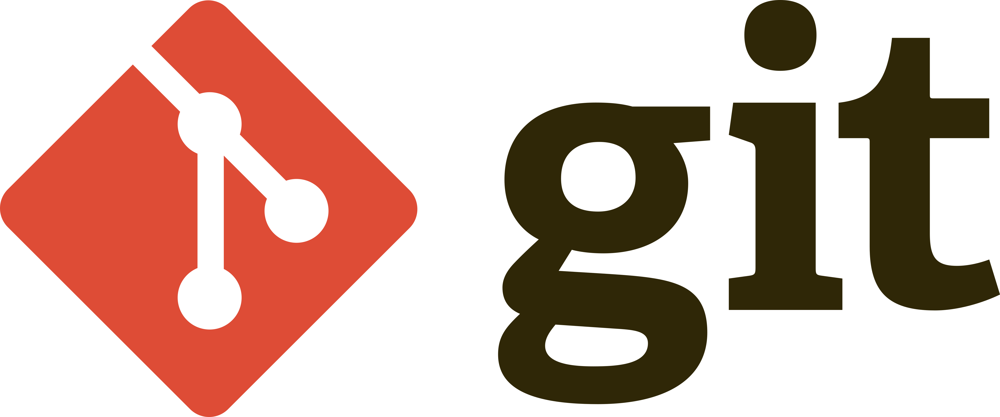
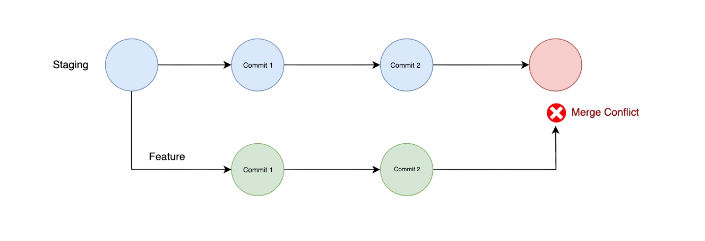

# SCESI Git Course

In this project, I'll learn Git using the repository as class notes (I'll do it in English for my personal enjoy).

<p align="center">
    
</p>

 ## Author 

 <a href="https://wgamba.github.io/" target="_blank">***wGamba***</a>

 ## First class: Git Introduction 

 ### Version Control System

 #### What is a Version Control System?

 A version control system (VCS) is a tool that helps you keep track of changes to files over time. It allows you to revert to previous versions, collaborate with others, and manage different versions of your code.

#### Why is Version Control System important?

* **Performance** : Only the requiered data is saved.
* **Security** : Saves every action.
* **Flexibility**: Linear development is not required.

### History
* **1990**: Early VCS tools like RCS and CVS emerged.

* **2005**: <a href="https://en.wikipedia.org/wiki/Linus_Torvalds" target="_blank">Linus Torvalds</a> created Git for Linux kernel development.


* **2008**: GitHub launched, boosting Git's adoption. It was initially created using Ruby.

* **2018**: Microsoft acquired GitHub, further expanding its reach.

* **2025**: GitHub leads the market with AI-driven features and advanced collaboration tools.


### What is Git?

Git stores a full repository copy locally, enabling offline work, and syncs with remote repositories for collaboration and backups.

<p align="center">
    
</p>


### What is a repository?

A repository, often referred to as a "repo," is a storage location where your project's files and their revision history are managed. It can be local (on your computer) or remote (hosted on platforms like GitHub). Repositories enable collaboration, version tracking, and centralized management of your codebase.

### Git Commands 

#### Git help

**`git --help`** displays a list of available Git commands and their descriptions. Use it to get quick help or details about specific commands.

#### Git init

**`git init`** initializes a new Git repository in your project directory. It creates a hidden `.git` folder to track changes and manage version control. Use it to start versioning your project.

**`<directory Project> git init`** It is possible to create a Git repository in an already existing directory by using the command `<directory Project> git init`. This initializes Git in the specified directory without affecting its current files. 

## Second class: States and Commits

### The three states of Git

In Git, a state refers to the status of your files in the version control process. 


* **Modified** : The file has been created, changed or delted but not yet staged for commit. 
* **Staged** : The file is marked to be included in the next commit.
* **Commited** : The changes are saved to the local repository.

<p align="center">
    
</p>

### What is a commit?

A commit is a snapshot of your project's changes at a specific point in time. It acts as a save point, allowing you to track and revert changes if needed. 

Each commit contains a unique identifier, a description of the changes made, and additional details such as the author and the time when the commit was made.

<p align="center"><strong>In short, it's like a checkpoint in video games.</strong></p>
 
<p align="center">
    
</p>

### How do I make a commit?

#### Git Status

The first step is to check the current status of your repository using the command:

<p align="center"><strong><code>git status</code></strong></p>


 This command checks the status of your files and shows:

* Files that have been modified but not yet staged.
* Files that are staged and ready to be committed.
* Untracked files (new files that Git is not yet tracking).

#### Git Add

Once you know which files you want to include in your commit, you need to stage them using `git add`command. For example:

<table align="center">
  <tr>
    <th>Command</th>
    <th>Description</th>
  </tr>
  <tr>
    <td><code>git add &lt;file&gt;</code></td>
    <td>Stage a specific file</td>
  </tr>
  <tr>
    <td><code>git add .</code></td>
    <td>Stage all modified files</td>
  </tr>
</table>

**Tip :** Use `git restore staged <file>` to unstage.

#### Git Commit

After staging the files, you can create a commit using the `git commit` command. For example:

<p align="center">
  <table>
    <tr>
      <th>Command</th>
      <th>Description</th>
    </tr>
    <tr>
      <td><code>git commit</code></td>
      <td>Add commit message in your IDE</td>
    </tr>
    <tr>
      <td><code>git commit -m "Your commit message"</code></td>
      <td>Add commit message directly</td>
    </tr>
    <tr>
      <td><code>git commit --amend</code></td>
      <td>Modify last commit message or include new staged changes</td>
    </tr>
  </table>
</p>

It is important to understand that these changes will be saved in your local repository. From this point on, to undo these changes, you will need to revert them by creating a new commit in the repository's change history.

<p align="center">
    
</p>

### How to untrack a file?

Create a `.gitignore` file in your project and add the following patterns to tell Git which files or folders to ignore:

<table align="center">
  <thead>
    <tr>
      <th>Description</th>
      <th>Pattern in .gitignore</th>
    </tr>
  </thead>
  <tbody>
    <tr>
      <td>Ignore all <code>.log</code> files</td>
      <td><code>*.log</code></td>
    </tr>
    <tr>
      <td>Ignore the <code>node_modules</code> folder</td>
      <td><code>node_modules/</code></td>
    </tr>
    <tr>
      <td>Ignore a specific file</td>
      <td><code>secrets.env</code></td>
    </tr>
  </tbody>
</table>

#### What to do if the file is already commited?

If the file is already already committed, simply adding it to `.gitignore` won’t stop Git from tracking it.  
You need to **untrack it manually** using this command:

<p align="center"><strong><code>git rm --cached secrets.env
</code></strong></p> 


### What is the Head?

In Git, the **HEAD** is a pointer that represents the current branch and commit you are working on. When you make a new commit, the HEAD moves forward to point to that new commit. It helps Git keep track of your current position in the repository's history.

### Git log 

The `git log` command displays the commit history of your repository. It shows details such as commit hashes, author names, dates, and commit messages. This is useful for reviewing changes made over time.

Additionally, `git log` helps track the **HEAD** by showing the most recent commit it points to. This allows you to understand your current position in the repository's history and navigate between commits if needed.

Example usage:

<table align="center">
  <thead>
    <tr>
      <th>Command</th>
      <th>Description</th>
    </tr>
  </thead>
  <tbody>
    <tr>
      <td><code>git log</code></td>
      <td>Shows full commit detail</td>
    </tr>
    <tr>
      <td><code>git log --oneline</code></td>
      <td>Shows each commit in one line</td>
    </tr>
  </tbody>
</table>


## Third class: Branchs, Merge and Conflicts

### Branch

#### What is a Branch?

A branch in Git is a lightweight, movable pointer to a commit. It allows you to work isolated from the main codebase. By default, every Git repository starts with a branch named `main` (or `master` in older versions).

Branches enable parallel development, making it easier to collaborate and manage changes without affecting the main codebase until you're ready to merge.

##### Key Commands for Branch Management

<table align="center">
  <thead>
    <tr>
      <th>Command</th>
      <th>Description</th>
    </tr>
  </thead>
  <tbody>
    <tr>
      <td><code>git branch</code></td>
      <td>Lists all branches in the repository</td>
    </tr>
    <tr>
      <td><code>git branch &lt;branch-name&gt;</code></td>
      <td>Creates a new branch</td>
    </tr>
    <tr>
      <td><code>git checkout &lt;branch-name&gt;</code></td>
      <td>Switches to the specified branch</td>
    </tr>
    <tr>
      <td><code>git switch &lt;branch-name&gt;</code></td>
      <td>Alternative command to switch branches</td>
    </tr>
    <tr>
      <td><code>git branch -d &lt;branch-name&gt;</code></td>
      <td>Deletes a branch</td>
    </tr>
  </tbody>
</table>

<p align="center">
    
</p>

#### Why Use Branches?

* **Isolation**: Keep your work separate from the main codebase.
* **Collaboration**: Multiple developers can work on different branches simultaneously.
* **Experimentation**: Test new ideas without risking the stability of the main branch.

### Merge
#### Git Merge

The `git merge` command is used to combine changes from one branch into another. Typically, you merge a feature branch into the main branch after completing development. Merging helps integrate changes and maintain a unified codebase.

##### Types of Merge

1. **Fast-forward merge**: Occurs when the branch being merged has no additional commits compared to the current branch. Git simply moves the pointer forward.
2. **Three-way merge**: Happens when both branches have diverged. Git creates a new commit to combine the changes.

##### Key Options for `git merge`

<table align="center">
  <thead>
    <tr>
      <th>Option</th>
      <th>Description</th>
    </tr>
  </thead>
  <tbody>
    <tr>
      <td><code>--edit</code></td>
      <td>Allows you to edit the default merge commit message</td>
    </tr>
    <tr>
      <td><code>--no-commit</code></td>
      <td>Prepares the merge but does not create a commit automatically</td>
    </tr>
    <tr>
      <td><code>git branch -d &lt;branch-name&gt;</code></td>
      <td>Deletes a branch after its changes have been successfully merged into another branch</td>
    </tr>
    <tr>
      <td><code>git branch -D &lt;branch-name&gt;</code></td>
      <td>Forces deletion of a branch even if its changes have not been merged into another branch (unmerged changes will be lost)</td>
    </tr>
    <tr>
      <td><code>git merge --abort</code></td>
      <td>Cancels the merge process in case of conflicts and restores the state before the merge</td>
    </tr>
    <tr>
      <td><code>git merge --no-ff &lt;branch-name&gt;</code></td>
      <td>Performs a "no fast-forward" merge, creating a new merge commit even if Git could merge automatically</td>
    </tr>
    </tbody>
  </table>

##### Example Usage

1. Merge a branch and edit the commit message:
   ```bash
   git merge feature-branch --edit
   ```

2. Merge a branch without committing immediately:
   ```bash
   git merge feature-branch --no-commit
   ```

This allows you to review or make additional changes before finalizing the merge.

### Delete Branches

#### Why delete branches?

Because it`s a good practice, and the essence of bran ches is that they should have a simple purpose and a short period of time.

<table align="center">
  <thead>
    <tr>
      <th>Action</th>
      <th>Command</th>
    </tr>
  </thead>
  <tbody>
    <tr>
      <td>Delete local branch</td>
      <td><code>git branch -d &lt;branch-name&gt;</code></td>
    </tr>
    <tr>
      <td>Delete remote branch</td>
      <td><code>git push origin --delete &lt;branch-name&gt;</code></td>
    </tr>
  </tbody>
</table>

### Git conflict

**Conflicts in Git**

What happens if, when trying to merge two branches, the destination branch has made changes to the same lines of a file as the ones we want to merge?

<p align="center"><strong>We would have conflicts</strong></p>

<p align="center">
    
</p>

#### Resolving Git conflicts


When resolving conflicts in Git, you need to decide how to handle the changes between the branches. The conflict occurs when two branches modify the same lines of a file differently. Here's how to resolve them:

**Decide between the changes:**
   - Keep the changes from the `main` branch.
   - Keep the changes from the `changes` branch.
   - Modify the changes to create a custom merge.

**Conflict Markers in the File:**
   When a conflict occurs, Git marks the conflicting section in the file like this:
   ```plaintext
   <<<<<<< HEAD
   <p>This is our initial content</p>
   <p>New content to the file</p>
   =======
   <p>Completely different content</p>
   >>>>>>> changes
   ```
   - **Above `=======`**: Content from the current branch (`HEAD`).
   - **Below `=======`**: Content from the branch being merged (`changes`).

## Fourth class: GitHub

### What is GitHub?

GitHub is a web-based platform for version control and collaboration, built on top of Git. It allows developers to host, manage, and share their code repositories while providing tools for collaboration, issue tracking, and project management.

### How to Create a Repository on GitHub?

Creating a repository on GitHub is a straightforward process. Follow these steps:

1. **Log in to GitHub**  
  Go to [GitHub](https://github.com/) and log in with your credentials.

2. **Navigate to the New Repository Page**  
  Click the `+` icon in the top-right corner of the page and select **New repository**.

3. **Fill in Repository Details**  
  - **Repository Name**: Enter a unique name for your repository.
  - **Description** (optional): Add a brief description of your project.
  - **Visibility**: Choose between **Public** (visible to everyone) or **Private** (only accessible to you and collaborators).

4. **Initialize the Repository**  
  - Optionally, check the box to **Add a README file**. This file is often used to describe your project.
  - You can also add a `.gitignore` file to specify files Git should ignore.
  - Optionally, choose a license for your project.

5. **Create the Repository**  
  Click the **Create repository** button to finalize.

6. **Clone the Repository**  
  After creating the repository, you can clone it to your local machine using the command:
  ```bash
  git clone <repository-url>
  ```


<p align="center">
  
</p>

### Github extra features

#### Pull Requests

A **pull request** is a feature in GitHub that allows developers to propose changes to a repository. It facilitates code review and collaboration before merging changes into the main branch.

#### Issues

GitHub **Issues** are used to track tasks, enhancements, and bugs for your projects. They provide a way to discuss and manage work collaboratively.

#### GitHub Pages

**GitHub Pages** allows you to host static websites directly from your repository. It is commonly used for project documentation or personal portfolios.

**Github Page example:**

<p align="center">
  <a href="https://wgamba.github.io/">https://wgamba.github.io/</a>
</p>

### Git commands to work with GitHub

1. **Clone a Repository**  
  Download a remote repository to your local machine:
  ```bash
  git clone <repository-url>
  ```

2. **Add a Remote**  
  Link your local repository to a remote one:
  ```bash
  git remote add origin <repository-url>
  ```

3. **Push Changes**  
  Upload your local commits to the remote repository:
  ```bash
  git push origin <branch-name>
  ```

4. **Pull Changes**  
  Fetch and merge changes from the remote repository:
  ```bash
  git pull origin <branch-name>
  ```

## Fifth class: Git Flow

### What is a Git Flow?

Gitflow is a Git workflow strategy that organizes how branches are used to manage features, releases, and fixes in a structured and consistent way across a team.

### Gitflow

Gitflow is a branching model for Git that defines a strict workflow:

1. **main** → stable production branch

2. **develop** → main development branch

3. **feature** → for new features

4. **release** → for preparing releases

5. **hotfix** → for quick fixes on production

### GitHub Flow

GitHub Flow is a Git workflow designed for continuous deployment projects. It's simpler than Gitflow.

Basically, it works like this:

* You always work off the **main branch** (or master).

* You **create small branches** for each change (feature, fix, etc.).

* You open a **pull request** (PR) to discuss and review the change.

* Once it's approved, you **merge it into main**.

* Deploy directly from main (to production or your environment).

It's perfect for teams that work fast and need to move changes quickly without the heavier branch structure of Gitflow.

### Trunk Based Development

Trunk Based Development is a Git workflow that focuses on continuous integration with a single primary branch.

1. **Trunk** (main): → the central development branch where all code is merged frequently.

2. **Feature Branches**: small branches created for specific changes (feature, bugfix, etc.).

3. **Frequent Merges**: developers merge their feature branches into trunk regularly, often multiple times a day.

4. **Continuous Integration**: code is integrated into the main branch continuously, allowing for faster feedback and deployment.

5. **Short-lived Branches**: feature branches are short-lived, preventing long-running branches and reducing merge conflicts.

**Use Case**
Trunk Based Development is ideal for teams practicing continuous integration (CI) and continuous deployment (CD). It promotes fast feedback loops, minimizes merge conflicts, and is perfect for agile, high-speed development environments.