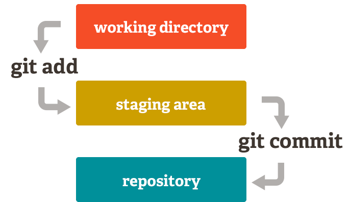

# SCESI Git Course

In this project, I'll learn Git using the repository as class notes (I'll do it in English for my personal enjoy).

 ## Author 

 <a href="https://wgamba.github.io/" target="_blank">***wGamba***</a>

 ## First class: Git Introduction 

 ### Version Control System

 #### What is a Version Control System?

 A version control system (VCS) is a tool that helps you keep track of changes to files over time. It allows you to revert to previous versions, collaborate with others, and manage different versions of your code.

#### Why is Version Control System important?

* **Performance** : Only the requiered data is saved.
* **Security** : Saves every action.
* **Flexibility**: Linear development is not required.

### History
* **1990**: Early VCS tools like RCS and CVS emerged.

* **2005**: <a href="https://en.wikipedia.org/wiki/Linus_Torvalds" target="_blank">Linus Torvalds</a> created Git for Linux kernel development.

* **2008**: GitHub launched, boosting Git's adoption. It was initially created using Ruby.

* **2018**: Microsoft acquired GitHub, further expanding its reach.

* **2025**: GitHub leads the market with AI-driven features and advanced collaboration tools.

### What is Git?

Git stores a full repository copy locally, enabling offline work, and syncs with remote repositories for collaboration and backups.

    

### What is a repository?

A repository, often referred to as a "repo," is a storage location where your project's files and their revision history are managed. It can be local (on your computer) or remote (hosted on platforms like GitHub). Repositories enable collaboration, version tracking, and centralized management of your codebase.

### Git Commands 

#### Git help

**`git --help`** displays a list of available Git commands and their descriptions. Use it to get quick help or details about specific commands.

#### Git init

**`git init`** initializes a new Git repository in your project directory. It creates a hidden `.git` folder to track changes and manage version control. Use it to start versioning your project.

**`<directory Project> git init`** It is possible to create a Git repository in an already existing directory by using the command `<directory Project> git init`. This initializes Git in the specified directory without affecting its current files. 

## Second class: States and Commits

### The three states of Git

In Git, a state refers to the status of your files in the version control process. 

* **Modified** : The file has been created, changed or delted but not yet staged for commit. 
* **Staged** : The file is marked to be included in the next commit.
* **Commited** : The changes are saved to the local repository.

    

### What is a commit?

A commit is a snapshot of your project's changes at a specific point in time. It acts as a save point, allowing you to track and revert changes if needed. 

Each commit contains a unique identifier, a description of the changes made, and additional details such as the author and the time when the commit was made.

<strong>In short, it's like a checkpoint in video games.</strong>

 

    

### How do I make a commit?

#### Git Status

The first step is to check the current status of your repository using the command:

<strong><code>git status</code></strong>

 This command checks the status of your files and shows:

* Files that have been modified but not yet staged.
* Files that are staged and ready to be committed.
* Untracked files (new files that Git is not yet tracking).

#### Git Add

Once you know which files you want to include in your commit, you need to stage them using `git add`command. For example:

<strong><code>git add &lt;file&gt;</code></strong>

<small>(specific file)</small>

<strong>or</strong>

<strong><code>git add .</code></strong>

<small>(all modified files)</small>

#### Git Commit

After staging the files, you can create a commit using the `git commit` command. For example:

<strong><code>git commit</code></strong>
 
<small>(add commit message in your IDE)</small>

<strong>or</strong>
 

<strong><code>git commit -m "Your commit message"</code></strong>
 
<small>(add commit message directly)</small>

It is important to understand that these changes will be saved in your local repository. From this point on, to undo these changes, you will need to revert them by creating a new commit in the repository's change history.

    

